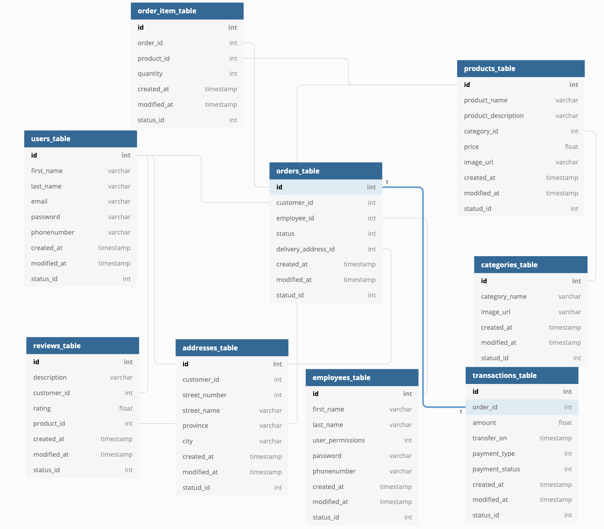

# Food-Delivery-REST-API



## Installation

* Clone the repo by using ```git clone```.
* Run ```npm install``` on the cloned directory.
* Add a file config.js that contains the database credentials.

## License

Copyright (c) 2020-present Ahmed Khalil Merchaoui

    Licensed under the Apache License, Version 2.0 (the "License");
    you may not use this file except in compliance with the License.
    You may obtain a copy of the License at
    
       http://www.apache.org/licenses/LICENSE-2.0
    
    Unless required by applicable law or agreed to in writing, software
    distributed under the License is distributed on an "AS IS" BASIS,
    WITHOUT WARRANTIES OR CONDITIONS OF ANY KIND, either express or implied.
    See the License for the specific language governing permissions and
    limitations under the License.
